# A comparative study of Latent Diffusion Models and Visual Autoregressive Models
If you have ever used AI you might have been fascinated to see models generate insanely realistic images, really long essays, or even creating videos out of thin air. Just type a prompt and something meaningful appears. Behind this "magic" there are a few ways or mechanisms to teach the model to create.

Two of the most commonly used ways are **Diffusion models** and **Autoregressive models**. Even though they often achieve similar results, they think in completely different ways. One starts with pure noise and slowly turns it into something structured, like sculpting from a block of marble. The other builds things piece by piece, step by step, like writing a sentence.

Diffusion models have dominated image generation, while autoregressive models have produced great results on text based tasks. But things are starting to shift.

In this blog, we’ll break down both approaches in a simple, intuitive way. We’ll look at how they work, where they shine, and where they fall short. But more importantly, when should you use diffusion, and when does autoregression make more sense?

---

## History of Autoregressive and Diffusion models

**Autoregressive Models**
Autoregressive models were one of the earliest approaches explored for image generation, inspired by their success in NLP based tasks. Some models like **PixelCNN**[^7] tried to process images sequentially like a text. While this felt theoretically correct, it quickly ran into practical limitations. Images are quite high-dimensional and generating them pixel by pixel resulted in extremely high inference time and compute. Moreover, flattening a 2D image into a 1D sequence disrupts spatial relationships.

Later approaches tried to improve this model by incorporating techniques like **VQ-VAE (Vector Quantised-Variational AutoEncoder)** for discrete tokenization and combining them with transformers. While they improved representation learning and scalability to some extent they still relied on next token prediction over flattened sequences. As a result, they remained computationally expensive and struggled to match the quality and efficiency of methods like diffusion modeling.

**Diffusion Models**
Diffusion models were initially underexplored. They were actually inspired by physics, and more specifically, non-equilibrium thermodynamics.

The concept was first introduced in a 2015 paper by Jascha Sohl-Dickstein[^4]. Their idea was: what if we take a real image, slowly destroy it by adding static noise until it is unrecognizable, and then teach a neural network to reverse that exact process? Despite the brilliant theory, without the practical applications, diffusion didn't gain popularity. It wasn't until 2020, when Jonathan Ho and his team introduced **DDPMs (Denoising Diffusion Probabilistic Models)**[^2], that the AI community realized this noise-reversing method could actually rival existing image generators like **GANs (Generative Adversarial Networks)**[^1].

Researchers realized that running this denoising process on high-resolution pixel grids was too slow. Compressing the image into a smaller mathematical representation, do the denoising there, and decompressing it at the end would be better. This birthed **Latent Diffusion Models (LDMs)**. Models like **Stable Diffusion, Midjourney**, and **DALL-E** exploded onto the scene, capable of generating realistic images on consumer hardware, and making diffusion the champion of the visual AI world.

---

# Text-to-Image Conditioning with Latent Diffusion Models

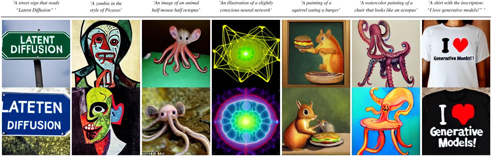

Traditional diffusion models (DDPMs) worked in high-dimensional pixel spaces, making them computationally expensive to train and very slow to generate images. Because of this, they could not produce high-resolution outputs efficiently.

In other words, these traditional models processed the entire high-resolution image tensor as it was for most of the training. Imagine running heavy computations 1,000 times on a $1024 \times 1024 \times 3$ tensor. Only the GPU cost would dig holes in your pockets.

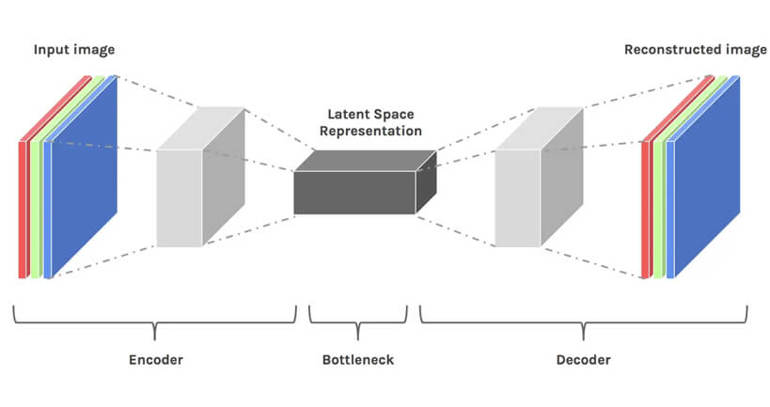

Latent Diffusion Models (LDMs) solved this by doing most of the compute in a smaller, "latent" space. But before we deep-dive into the architecture that makes this possible, these are the basic mathematical terms we might use:

- $t$: This is the current time step. This usually goes from $0$ to $1$. We split our process into $T$ steps of size 1/ $T$. 

- $z$: This is the compressed, "latent" version of an image.

- $p_{\text{data}}$: The true probability distribution of our data, where all real images in our dataset exist.

-  $p_{\text{init}}$: The initial distribution at $t=0$. This is usually pure, random noise (a Gaussian distribution in our case).

## Phase 1: 

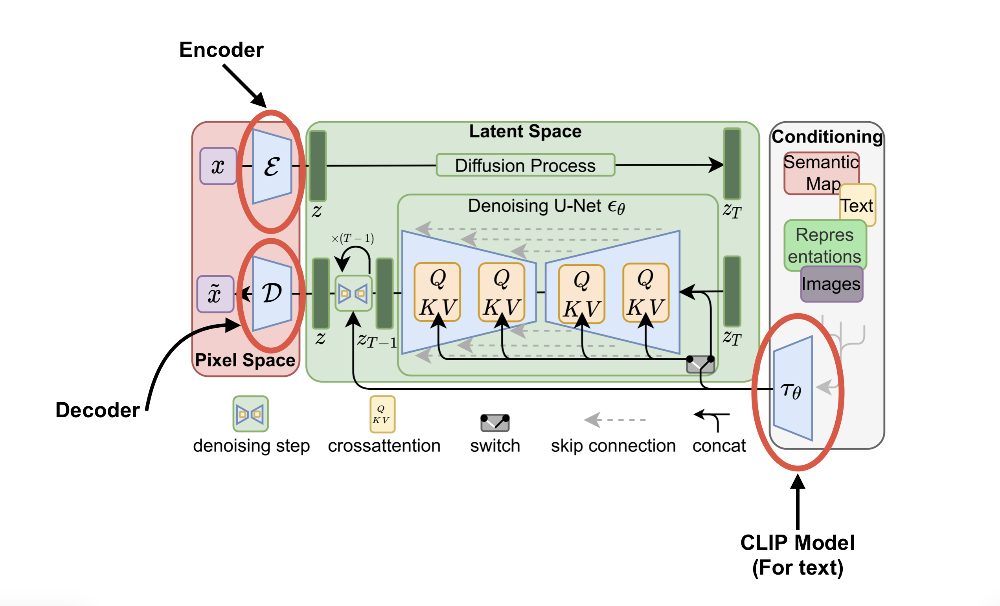

Imagine a Latent Diffusion model as a car, and for a moment lets be mechanics trying to build the car. So heres the components we’re supposed to assemble.
### 1. The Variational Autoencoder (VAE)

The VAE is what separates the standard models like DDPMs from LDMs. It is made of two parts, as labeled $\mathcal{E}$ and $\mathcal{D}$ in the diagram:
- **The Encoder ($\mathcal{E}$):** This compresses raw, high-resolution images into a much smaller 2D latent space.
- **The Decoder ($\mathcal{D}$):** This learns to reconstruct compressed data back to a high-resolution image.
This drastically reduces computation costs. Instead of processing huge $1024\times1024\times3$ images, the main diffusion process happens in this small latent space. 
The VAE we use is trained independently on a diverse dataset of landscapes, faces, animals, cars so it learns to compress and decompress any concept, not just specific ones like faces.

### 2. The Discriminator & VGG Classifier

To make sure the VAE's Decoder is outputting realistic images, we train it with these two for parameter updation:

1.  **The PatchGAN Discriminator:** This is a Generative Adversarial Network trained simultaneously to look at tiny patches (like 70x70 pixels) of the decoded image, acting only as a texture critic. 
    Why texture? When uncertain, the safest option for L1 or L2 loss functions is to output the median or mean of all possible pixel values. Averaging distinct, sharp pixels (like dark and light green grass blade colours) creates blurry, smooth edges. Using only the Discriminator component, the PatchGAN adversarial loss penalises the blurriness this causes, forcing the Decoder to output only sharp, realistic pixels.

2.  **The VGG Image Classifier:** A pre-trained image classifier with frozen weights is used to calculate "Perceptual Loss." Instead of just comparing pixels directly, it compares the internal feature maps to ensure the generated image looks structurally identical to a real one to the human eye.

### 3. The CLIP Model

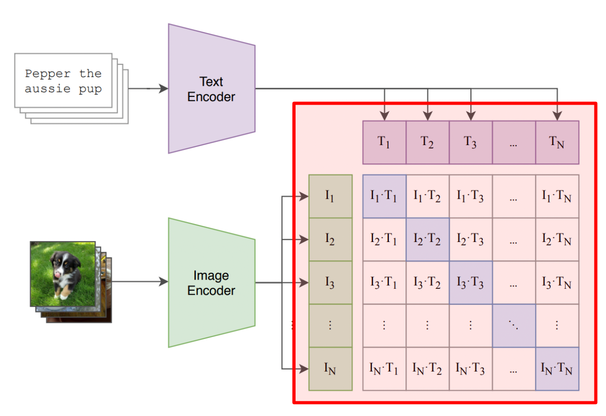

In an LDM, the text prompt conditions the image generation. But we can't input raw text directly into a neural networks; they understand the math, not English.

This is where the **CLIP (Contrastive Language-Image Pre-training)** text encoder comes in. It converts human prompts like "a boy holding a coffee cup" into mathematical text embeddings of the same input size as of the noisy starting image inside the U-Net (discussed below). These embeddings get fed into the U-Net to guide the generation process.

### 4.  The U-Net

The U-Net puts the "diffusion" in the Latent Diffusion model. Its only motive is: learn how to remove added mathematical noise from the compressed latent representations.

It looks at the noisy latent vector, the timestep $t$ (how much noise was added), and the Text Prompt embeddings. It predicts what the noise was a step before and subtracts it to give a slightly cleaner input $x_{t-1}$. Its parameters ($\theta$) are updated using the Mean Squared Error (MSE) loss. 

$$\text{Loss}_{LDM} = \mathbb{E}_{z, \epsilon \sim \mathcal{N}(0,1), t} \left[ || \epsilon - \epsilon_\theta(z_t, t, \text{text}) ||^2 \right]$$
 
**Classifier-Free Guidance**: To force the model to follow the prompt, we randomly drop the text conditioning during training. During generation, the U-Net runs twice, once with the text and once without it and mathematically we push the generation in the direction of the conditioned prompt. 

## Phase 2: Inference

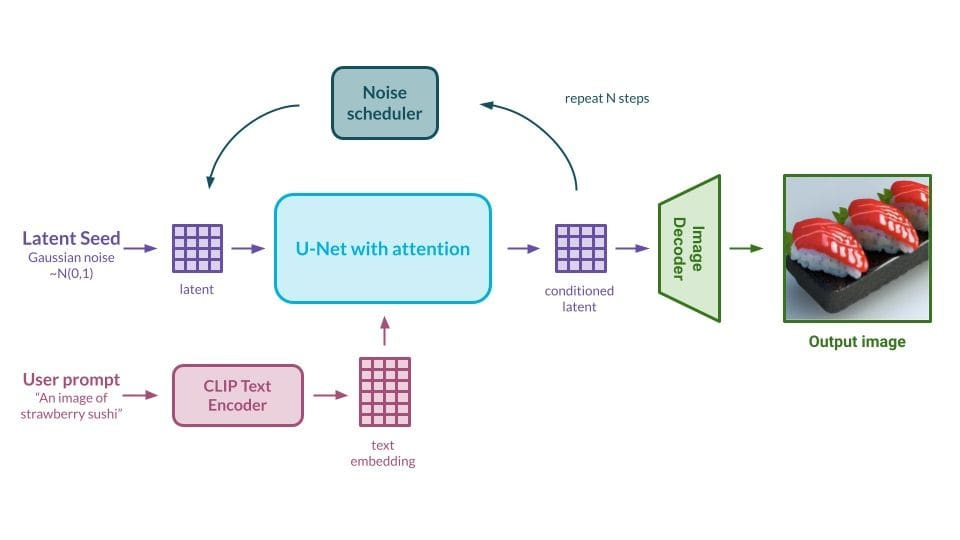

How do we put together our components the VAE, the U-Net, and the CLIP model to generate a very realistic image? And from what? Here's what:

1. You type "a boy holding a coffee cup". The **CLIP text encoder** processes this prompt and turns it into a mathematical embedding.

2. The model samples a completely random tensor of pure noise _in the latent space_. This is our blank canvas, $p_{\text{init}}$ (only that it its not white, or a canvas)
   
   $$\text z_T \sim \mathcal{N}(0,1) $$
4. This random noise is fed into the **U-Net**. Using **Cross-Attention**, the U-Net looks at the CLIP text embeddings and the input $z_{t}$ at timestep $t$ to understand what it is supposed make the final image look like. It uses Self-Attention to look at other image features across the whole canvas. Step-by-step, the U-Net predicts the noise in the latent space and outputs $z_{t-1}$.

5. After repeating this denoising loop $T$ times, we are left with a clean,  latent representation of a boy holding a coffee cup.

6. Finally, this clean latent tensor is passed through the **VAE Decoder**. The Decoder upscales and decompresses this mathematical representation back into the high-dimensional pixel space like it was trained to, leaving us with a high-resolution image of a boy holding a coffee cup.

During training, we are trying to bring our initial noise distribution $p_{\text{init}}$ as close to the true data distribution $p_{\text{data}}$ as possible. But why do we need a U-Net to do this? Why can't we just use direct mathematics? 

In standard diffusion math, we use $q$ to represent the "true" representation of probability, and $p_\theta$ to represent our neural network's attempt to guess it. If we want to mathematically calculate the exact reverse step for cleaning the image, we have to use Bayes' Theorem:
$$q(z_{t-1}|z_t)=\frac{q(z_t|z_{t-1})\cdot q(z_{t-1})}{q(z_t)}$$

The Numerator: $q(z_t|z_{t-1})$ is just the forward process of adding noise, which we control and hence we know.
The Denominator (The Problem): $q(z_t)$ is the marginal probability of that specific noisy image existing. 

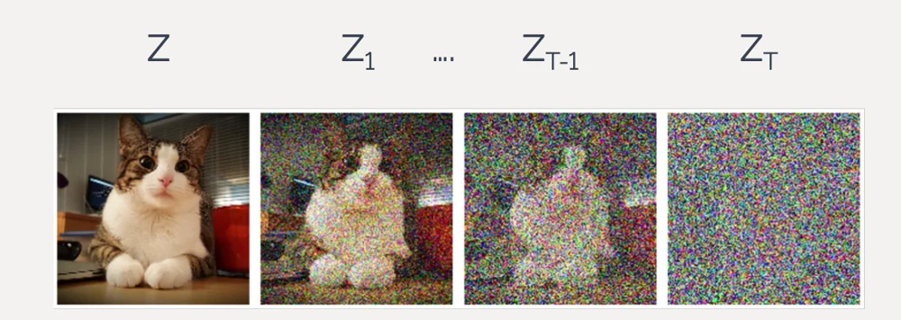

For this we need the mathematical formula for the entire dataset of real-world images. 
This is computationally impossible, or in math terms _intractable_ because real images are too complex. We cannot write a single algebraic equation that outputs a high probability for a realistically generated face and a low probability for TV static looking noise.

Because we cannot calculate the reverse path $q(z_{t-1}|z_t)$, we have to approximate it using our U-Net neural network. It gives us an estimated probability distribution: $p_\theta(z_{t-1}|z_t)$. Here $\theta$ is the the weights and biases of our neural network which we can update.

Step-by-step, this whole process models the meaningless distribution of random noise ($p_{init}$) into the shape of the highly structured distribution of real images ($p_{data}$).

---

# Visual Autoregressive Models (VAR): A Promising Alternative to Diffusion?[^5]
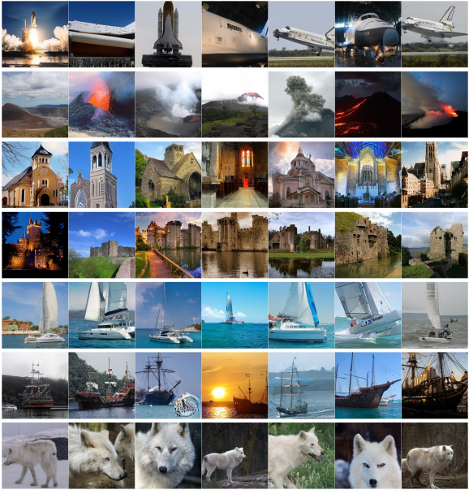

Autoregressive models have been quite successful in natural language processing (NLP) based tasks but whenever applied in the field of Computer Vision the results haven't been up to the mark. The main reason is that text has a natural sequential structure, whereas images are inherently two-dimensional and lack a canonical ordering. Flattening them into sequences disrupts their spatial structure.

That's where Visual Autoregressive Models (VARs) come into play. They address this issue by shifting from the classic approach of predicting the next token in a flattened sequence, they introduce a fundamentally different approach **next-scale prediction**. 
Instead of treating an image as a long sequence VAR treats it like a hierarchy of resolutions or representations. It is very similar to the way we humans draw, first defining a general structure and then refining the details.

## From Next Token to Next-Scale Prediction
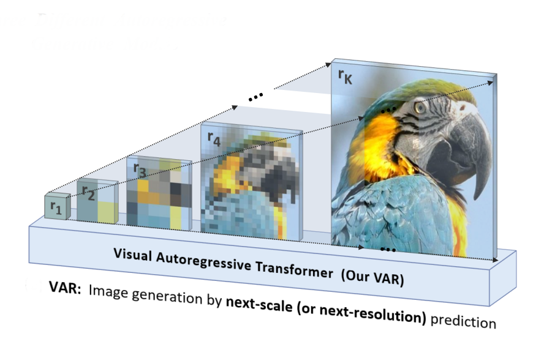

Traditional autoregressive image models follow a fixed and simple pipeline:

1. Convert an image into discrete tokens using a tokenizer (e.g., VQ-VAE)
2. Flatten the 2D grid of tokens into a 1D sequence
3. Train a transformer to predict the next token given previous ones

But this algorithm has a lot of inefficiencies, flattening destroys spatial structure of images and generation because tokens are produced one at a time.

Now VARs replace this approach entirely. **Instead of modeling an image as a sequence of tokens, it models it as a sequence of resolutions**.

In traditional autoregressive models, the generation process looks like:

* token $\to$ token $\to$ token $\to$ $\dots$

In VARs it becomes:

* low-resolution image $\to$ higher resolution $\to$ even higher resolution $\to$ final image

 Concretely, an image is represented as a hierarchy of token maps:

1. A very coarse representation (e.g., 1 $\times$ 1)
2. Intermediate resolutions (e.g., 16 $\times$ 16)
3. High-Resolution representation (e.g., 256 $\times$ 256)

Each level captures progressively finer details. The model then learns to generate the image coarse-to-fine, predicting each resolution conditioned on the previous ones.
So, it changes the autoregressive factorization from:

$$p(x_1, x_2, \dots, x_T) = \prod_{t=1}^{T} p(x_t \mid x_1, x_2, \dots, x_{t-1})$$

to:

$$p(r_1, r_2, \dots, r_k) = \prod_{k=1}^{K} p(r_k \mid r_1, r_2, \dots, r_{k-1})$$

where each $r_k$ isn't just a single token, but an entire grid of tokens at resolution $h_k \times w_k$

## Multi-Scale Tokenization[^6]
To implement this idea, VARs rely on a multi-scale quantization autoencoder. This autoencoder converts an image into multiple discrete representations at different resolutions.

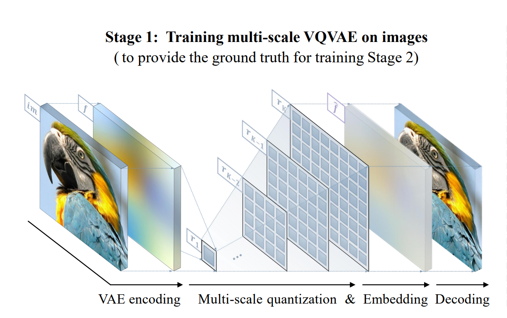

**Multi-Scale Encoding(Algorithm 1)**

The encoding process converts an image into its multi-scale token representation.

It works as follows:

1. Encode the image

    The input image is first passed through an encoder to produce a feature map:
   
   $$[f = \mathcal{E}(\text{im})]$$

2. Iterate over scales
    For each resolution level k = 1 to K:
    * The feature map is resized (interpolated) to the target resolution $h_k \times w_k$
    * This resized feature map is then quantized and stored as $r_k$:
      
$$[
r_k = \mathcal{Q}(\text{interpolate}(f, h_k, w_k))
]$$

3. Reconstruct approximation at this scale
The tokens are mapped back to feature space using the shared codebook:

$$[
z_k = \text{lookup}(Z, r_k)
]$$ 
- This is then upsampled back to the original resolution

4. Residual refinement

    A key step: the model subtracts this reconstructed signal from the feature map:
   
$$[
f = f - \phi_k(z_k)
]$$

Here, $\phi_k$ is a small convolutional module that processes the reconstructed features.

This multi-scale representation aligns closely with how humans perceive images. We first grasp the global structure like shapes, layout, and only then focus on fine details like textures and edges. VAR explicitly models this hierarchy.

## Generation and Training Mechanism
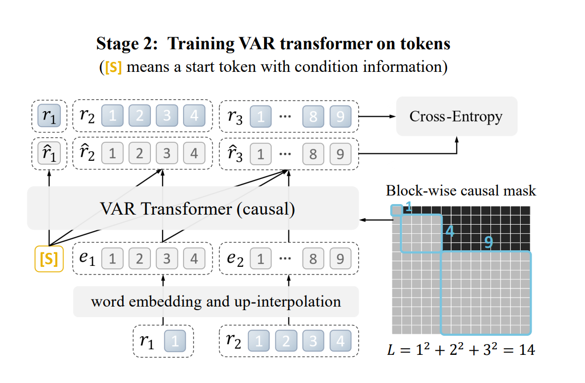

Once the image is represented as a sequence of token maps, the transformer is trained to generate these images sequentially across scales. In the generation process the transformer first generates lower resolution tokens and progressively generates higher resolution tokens.

 A key advantage of this approach is that all tokens within a given scale are generated in parallel. **Unlike traditional autoregressive models that generate one token at a time, VAR generates an entire grid at once for each scale**. This dramatically reduces inference time.

To maintain the autoregressive property, VAR uses a block-wise causal attention mask during training. This ensures that when predicting a token map at scale k, the model only has access to token maps from previous scales (1 to k−1), and not future ones, 
preserving the autoregressive property and preventing information leakage.

Within a scale, however, tokens are generated simultaneously and can attend to each other freely. This is a major departure from standard autoregressive models, where each token can only attend to previous tokens.

During inference, the process becomes even more efficient. Since generation proceeds strictly from lower to higher resolutions, there is no need for masking. Additionally, key-value (KV) caching can be ;
used to reuse computations from previous steps, further speeding up generation.

**Multi-Scale Reconstruction(Algorithm 2)**

1. **Initialize an empty feature map**
   
$$\hat{f}=0$$

2. **Iterate over scales**

    For each scale k = 1 to K :

   - Retrieve tokens $r_k$

   - Convert them back to feature vectors:
      
     $$z_k = \text{lookup}(Z, r_k)$$

   - Upsample to full resolution

   - Add the contribution to the feature map:

     $$\hat{f} = \hat{f} + \phi_k(z_k)$$

3. **Decode the final feature map**
   
   $$\hat{\text{im}} = \mathcal{D}(\hat{f})$$

So after the token maps have been generated by transformers across multiple scales then the decoder network reconstructs the final image via algorithm 2.

---

# Comparison
## Time Complexity
Latent diffusion models have a time complexity of  $$O(T \cdot n^2)$$

where T is number of denoising steps and number of image tokens. Each step is relatively cheap, but the need for many iterations(T) makes the overall process slow.

In contrast, VAR reduces the complexity of autoregressive generation from $O(n^6$) (in traditional AR models) to 

$$
O(n^4)
$$

by generating entire token maps at each scale instead of individual tokens as per recent study on its computational limits[^3].

## Inference Speed
During inference diffusion models require iterative denoising across many timesteps while VARs generate images across a small number of scales.
This can lead to faster inference speed on the same setups.

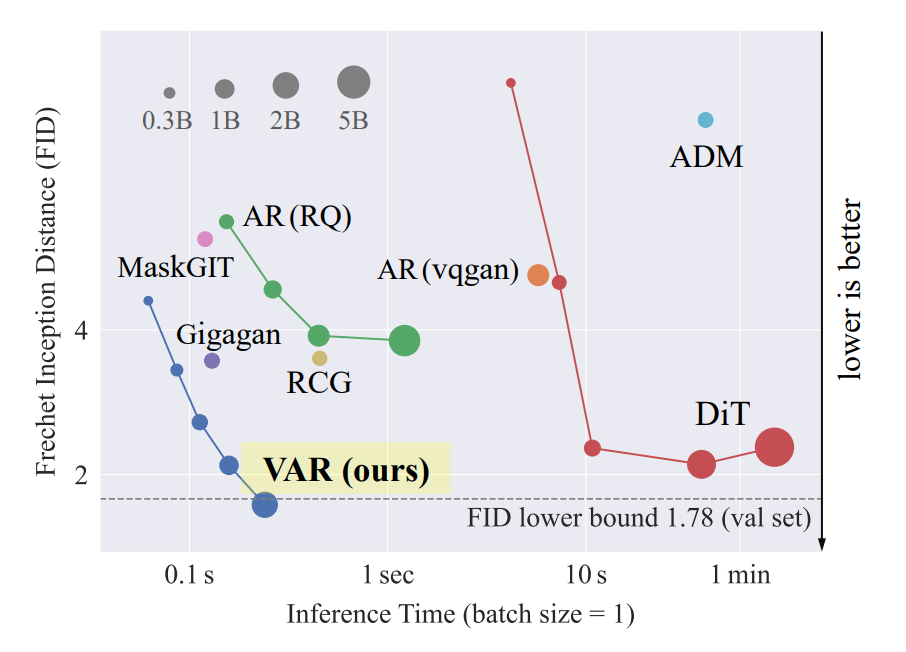

## Data Requirements and Scaling
Diffusion models are known to perform well even with moderately large datasets, but their scaling behavior is less predictable.
VARs seem to follow more predictable scaling trends till now, similar to autoregressive language models, though this is still an active area of research.

## Controllability
Because diffusion operates through iterative refinement, it allows interventions at intermediate steps and makes techniques like inpainting and guided editing possible. Apart from this, they also support Classifier guidance, Conditional generation with text, segmentation, etc.

VAR models, while capable of conditional generation, lack the same level of fine-grained iterative control. Therefore, Diffusion models are better suited for applications requiring precise control over outputs.

## Quality of Image Generated
In the research paper on VARs it has been stated that VARs proved to generate better quality images as compared to Latent Diffusion Models. They achieved a better FID (Fréchet Inception Distance) and IS (Inception Score) which are the two standard metrics to judge the quality of images generated.

The coarse-to-fine approach in VAR helps preserve global structure while refining details progressively.

---

# Conclusion: Diffusion vs. Autoregression
AI image generation is evolving at an extreme pace. For a long time, Latent Diffusion Models (LDMs) were the undisputed choice for visual tasks. By shifting the computational heavy compute to a compressed latent space, LDMs enabled high-quality and conditioned image generation. However, Visual Autoregressive Models (VAR) now provide a cut-throat competition. By abandoning the "next-token" flat sequence to a "next-scale" hierarchy, VARs solve the spatial and computational issues that earlier held autoregressive vision models back.

So, back to our initial question: when should you use diffusion, and when does autoregression make more sense?

**Choose Latent Diffusion Models (LDMs) for Control**: 
If you want precise text conditioning, fine-grained image editing, inpainting, or outpainting, LDMs are your best option. Their iterative denoising process is built for guided adjustments and highly specific user prompts.

**Choose Visual Autoregressive Models (VAR) for Speed and Scaling**: 
If you want fast inference speed, amazing raw image quality, and or massive datasets to train on, VAR is the stronger choice. Because they benefit from the same predictable scaling laws that Large Language Models (LLMs) use, more data and compute gives better results for VAR models.

But ultimately, we are not looking at a "winner" in AI image generation. While LDMs currently dominate the practical, consumer focused side of AI art, VARs have proven that the autoregressive approach is far from obsolete in computer vision. Maybe, the next massive breakthrough in generative AI might just be a fusion of both, combining the  fast scaling of autoregression with the pixel-perfect controllability of diffusion.

---

# References
[^1]: Rombach et al. (2023). *High-Resolution Image Synthesis with Latent Diffusion Models*
[Journal Link](https://arxiv.org/abs/2112.10752) 
[^2]: Jonathan ho et al. (2020). *Denoising Diffusion Probabilistic Models*
[Journal Link](https://arxiv.org/abs/2006.11239) 
[^3]: Yekun Ke et al. (2025): *On Computational Limits and Provably Efficient Criteria of Visual Autoregressive Models: A Fine-Grained Complexity Analysis*
[Journal Link](https://arxiv.org/abs/2501.04377) 
[^4]: Jascha Sohl-Dickstein et al. (2015): *Deep Unsupervised Learning using Nonequilibrium Thermodynamics*
[Journal Link](https://arxiv.org/abs/1503.03585)
[^5]: Keyu Tian et al. (2024): *Visual Autoregressive Modeling: Scalable Image Generation via Next-Scale Prediction*
[Journal Link](https://arxiv.org/abs/2404.02905)
[^6]: Aaron Van den Oord et al. (2017): *Neural Discrete Representation Learning*
[Journal Link](https://arxiv.org/abs/1711.00937)
[^7]: Aaron Van den Oord et al. (2016): *Conditional Image Generation with PixelCNN Decoders*
[Journal Link](https://arxiv.org/abs/1606.05328)
