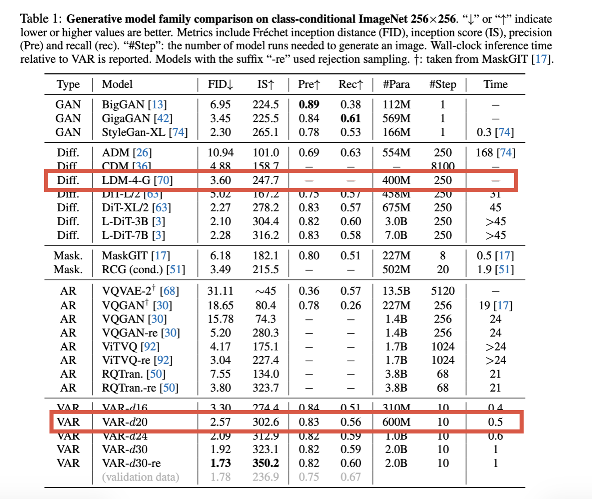

# Comparison
## Time Complexity
Latent diffusion models have a time complexity of:

$$
O(T \cdot n^2)
$$

where T is number of denoising steps. Each step is relatively cheap, but the need for many iterations makes the overall process slow.

In contrast, VAR reduces the complexity of autoregressive generation from $O(n^6$) (in traditional AR models) to 

$$
O(n^4)
$$

by generating entire token maps at each scale instead of individual tokens.

## Inference Speed
During inference 

* Diffusion models require iterative denoising across many timesteps.
* VARs generate images across a small number of scales(typically very few steps).

That's why VARs take less time during inference than diffusion models.

## Data Requirements and Scaling
Diffusion models are known to perform well even with moderately large datasets, but their scaling behavior is less predictable.

VAR models, on the other hand, exhibit clear scaling laws similar to Large Language Models(LLMs) i.e., performance improves consistently with more data.

## Controllability
Diffusion models currently have an advantage when it comes to controllability.

They support:

* Classifier guidance
* Conditional generation (text, segmentation, etc.)
* Fine-grained editing (inpainting, outpainting)

VAR models, while capable of conditional generation, lack the same level of fine-grained iterative control. Therefore, Diffusion models are better suited for applications requiring precise control over outputs.

## Quality of Image Generated
In the research paper on VARs it has been stated that VARs proved t generate better quality images as compared to Latent Diffusion Models. They achieved a better FID (Fréchet Inception Distance) and IS (Inception Score).

The coarse-to-fine approach in VAR helps preserve global structure while refining details progressively.

